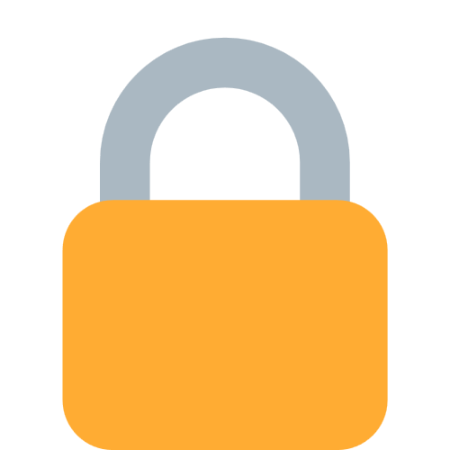
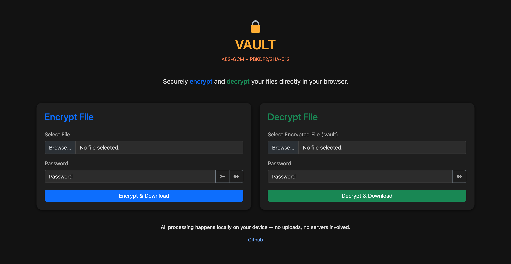

<div align="center">

<h1 align="center" style="color: #ffad32">VAULT</h1>

**Securely <span style="color: #0d6dfd">encrypt</span> and <span style="color: #198754">decrypt</span> your files directly in your browser.**

<p align="center">
<a href="https://github.com/polius/vault/actions/workflows/release.yml"></a>&nbsp;<a href="https://github.com/polius/vault/releases"></a>&nbsp;<a href="https://hub.docker.com/r/poliuscorp/vault"></a>
</p>

<br>

*All processing happens **<span style="color: #ffad32">locally</span>** on your device — no uploads, no servers involved.*

<br>


</div>

## Installation

The recommended installation method is **Docker**.  

#### Run with Docker CLI

```bash
docker run -d --name vault -p 80:80 poliuscorp/vault
```

#### Run with Docker Compose

```yaml
services:
  vault:
    image: poliuscorp/vault
    container_name: vault
    ports:
      - "80:80"
    restart: unless-stopped
```

#### Run with Docker Compose (HTTPS Enabled)

- Download both the `docker-compose.yml` and `Caddyfile` from the **deploy** folder.
- Edit the `Caddyfile` and replace `yourdomain.com` to your actual domain name.
- Start the stack:

```
docker-compose up -d
```

Caddy will automatically obtain and renew SSL certificates for your domain via Let's Encrypt.

- (Optional) To stop and remove the stack:

```
docker-compose rm -f
```

## Accessing the Application

Once deployed, open your web browser and visit:

- **HTTP**: http://localhost/
- **HTTPS**: https://yourdomain.com (if configured)
