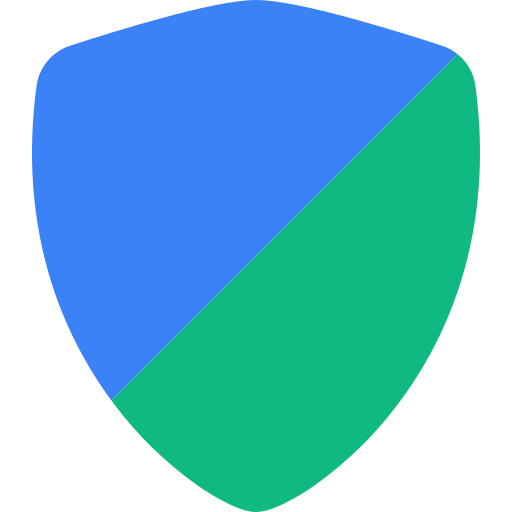
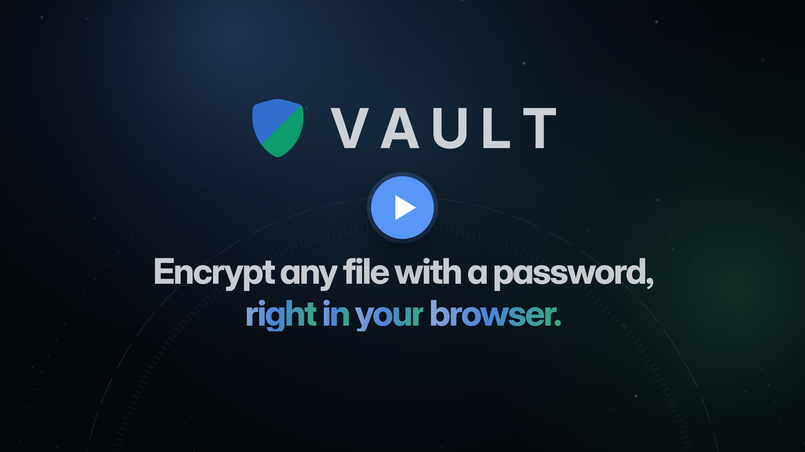

<div align="center">

<h1 align="center">VAULT</h1>

**Encrypt files locally.** Lock any file or folder with a password, right in your browser.<br>
Nothing is ever uploaded.

<p align="center">
<a href="https://github.com/polius/vault/actions/workflows/release.yml"></a>&nbsp;<a href="https://github.com/polius/vault/releases"></a>&nbsp;<a href="https://hub.docker.com/r/poliuscorp/vault"></a>
</p>

<a href="https://vault.alzina.dev/video.mp4"></a>

<p align="center">
<a href="https://vault.alzina.dev"><b>Try it at vault.alzina.dev</b></a> · <a href="#installation">Self-host</a> · <a href="#security-model">How it's secured</a>
</p>
</div>

## Features

- **Files or whole folders.** Several files or a folder become a single `.vault` file.
- **One drop zone.** Drop anything anywhere; `.vault` files switch to decrypt.
- **Strong crypto.** AES-256-GCM and Argon2id. File name and size are encrypted too.
- **Tamper-evident.** Wrong passwords fail up front; edited or truncated files are rejected.
- **Large files.** Streams straight to disk where the browser supports it.
- **Better passwords.** Strength estimate, confirmation field and passphrase generator.
- **Accessible.** Light and dark themes, keyboard and screen-reader friendly.

The `.vault` format is documented in [FORMAT.md](FORMAT.md), and the threat model in [SECURITY.md](SECURITY.md).

## Installation

The recommended installation method is **Docker**. The image is a static nginx site that runs as a non-root user and listens on port **8080** inside the container.

#### Run with Docker CLI

```bash
docker run -d --name vault -p 80:8080 poliuscorp/vault
```

#### Run with Docker Compose

```yaml
services:
  vault:
    image: poliuscorp/vault
    container_name: vault
    ports:
      - "80:8080"
    restart: unless-stopped
```

> [!IMPORTANT]
> Browsers only allow the cryptography VAULT needs on **HTTPS** pages (or `http://localhost`). Served over plain HTTP from another machine, VAULT shows a notice instead of working. For anything beyond your own computer, use the HTTPS setup below or put VAULT behind your existing reverse proxy.

## Run it with HTTPS

The [`deploy`](deploy) folder runs VAULT behind [Caddy](https://caddyserver.com), which gets and renews a Let's Encrypt certificate automatically.

1. Point a DNS record for your domain at the server, and open ports 80 and 443.
2. Download [`docker-compose.yml`](deploy/docker-compose.yml) and [`Caddyfile`](deploy/Caddyfile) into one folder.
3. In the `Caddyfile`, replace `yourdomain.com` with your domain.
4. Start the stack:

   ```bash
   docker compose up -d
   ```

5. Open `https://yourdomain.com`.

To stop and remove the stack: `docker compose down`.

#### Behind your own reverse proxy

Proxy to the container's port 8080. VAULT sends its own security headers (Content-Security-Policy, `X-Frame-Options`, and so on); don't strip them, and don't let the proxy or a CDN inject scripts into the page, as the CSP will block them. Add `Strict-Transport-Security` at the proxy.

#### Static hosting

`src/` is a plain static site with no build step, so you can serve it from any static host. The CSP is also set in a `<meta>` tag, but for the full set of headers copy the ones in [`nginx.conf`](nginx.conf) into your host's configuration.

## Using VAULT

Once deployed, visit `http://localhost/` (or your HTTPS domain).

- **Encrypt:** drop files or a folder, type a password twice (or generate a passphrase and copy it somewhere safe), and click **Encrypt**. Under **Options** you can give the output a neutral name so the file name doesn't reveal what's inside.
- **Decrypt:** drop a `.vault` file, type the password, and click **Decrypt**. Multi-file vaults come back as a ZIP.

There is no password recovery. If you lose the password, the data is gone.

## Security model

In short: everything happens in your browser, and nothing you drop on the page is sent anywhere. The server only delivers static files, and the page's Content-Security-Policy forbids it from connecting anywhere but its own origin. VAULT protects your files at rest and in transit; it can't protect against a compromised device or browser, or against a server that's been changed to deliver malicious code. Read [SECURITY.md](SECURITY.md) for the details and for how to report a vulnerability.

## License

[MIT](LICENSE).
